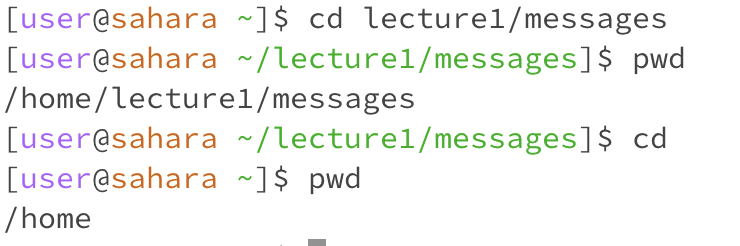

# Lab Report 1

## `cd` section

Using `cd` with no arguments did nothing when in the `/home` directory

Working Directory: '/home'

However, when using `cd` with no arguments in the `/home/lecture1/messages`, it brings the user back to the `/home` directory

Working directory: `/home/lecture1/messages`

---

Using `cd` with a directory as an argument changed the directory to the one listed, in this case `lecture1`

Working directory: `/home`

---

Using `cd` with a file as an argument resulted in an error, for it is not a directory. In this case, since `Hello.java` is not a directory and is a file, it throws an error at us

\

Working directory: `/home/lecture1`

---

## `ls` section

Using `ls` with no arguments outputs all directories and files in the current directory. In this case, all directories and files in the directory `lecture1` was outputted. Note that directories are in blue letters while files are in black.

Working directory: `/home/lecture1`

---

Using `ls` with a directory as an argument outputs all directories and files in the argument (which is a directory). In this cases, all files in the `messages` directory were outputted.

Working directory: `/home/lecture1`

---

Using 'ls' with a file will just output the file name.

Working directory: `/home/lecture1`

---

## `cat` section

Using `cat` with no arguments won't ouput anything, but prompt the user for an input. If the user inputs a string, it will output the same string back to the user. Note that no error is outputted and `cat` can be exited using Ctrl + D.

Working directory: `/home/lecture1`

---

Using `cat` with a directory as an argument will produce an error, for it is a directory and not a file. Since `cat` prints the contents of a file, it will not work with a directory.

Working directory: `/home/lecture1`

---

Using `cat` with a file as an argument prints the contents of the file

Working directory: `/home/lecture1`

---
