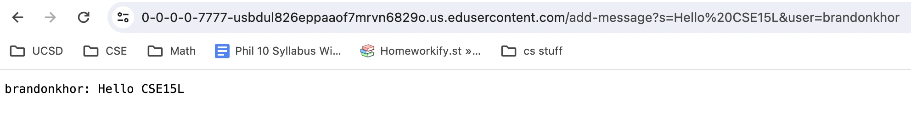
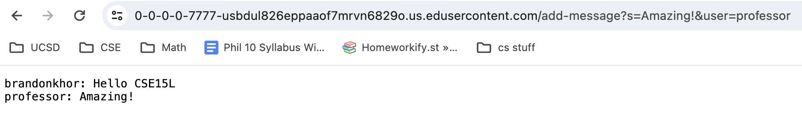
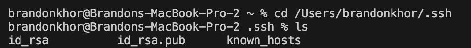
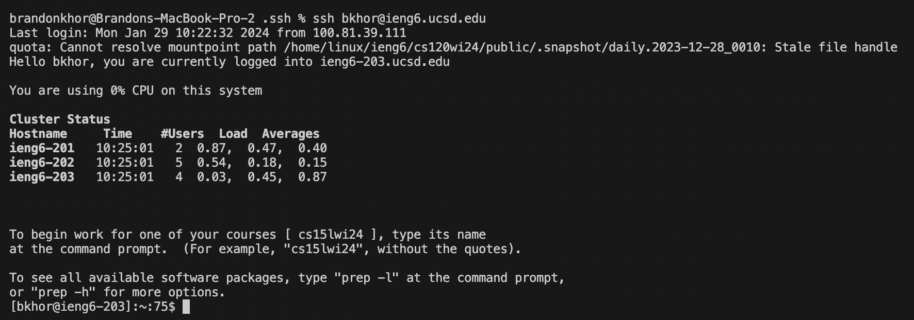

# Lab Report 2

## Code

```
import java.io.IOException;
import java.net.URI;

class Handler implements URLHandler {
    String entries = "";

    public String handleRequest(URI url) {
        if (url.getPath().equals("/")) {
            return String.format("Enter a string");
        }
        else if (url.getPath().contains("/add-message")) {
            String[] parameters = url.getQuery().split("=");
            if (parameters[0].equals("s")) {
                if (parameters[1].contains("&")) {
                    String[] queryParts = parameters[1].replace("+", " ").split("&");
                    entries += String.format("%s: %s", parameters[2], queryParts[0]);
                    entries += "\n";
                    return entries;

                }
                
            }
        }
        return "404 Not Found!";
        
    }
}

class ChatServer {
    public static void main(String[] args) throws IOException {
        if(args.length == 0){
            System.out.println("Missing port number! Try any number between 1024 to 49151");
            return;
        }

        int port = Integer.parseInt(args[0]);

        Server.start(port, new Handler());
    }
}
```

--- 

## Add Message Examples



After entering the URL, in the `Handler` class in `ChatServer.java`, 

For the `main` method in the `ChatServer` class, its parameter is `String[] args`, which takes in arguments from the command line. The first argument is stored into `int port`. 




---

## `ssh` Key Examples



Absolute path of private key: `/Users/brandonkhor/.ssh/id_rsa`

Absolute path of public key: `/Users/brandonkhor/.ssh/id_rsa.pub`

Example of terminal interaction without being asked for password:




