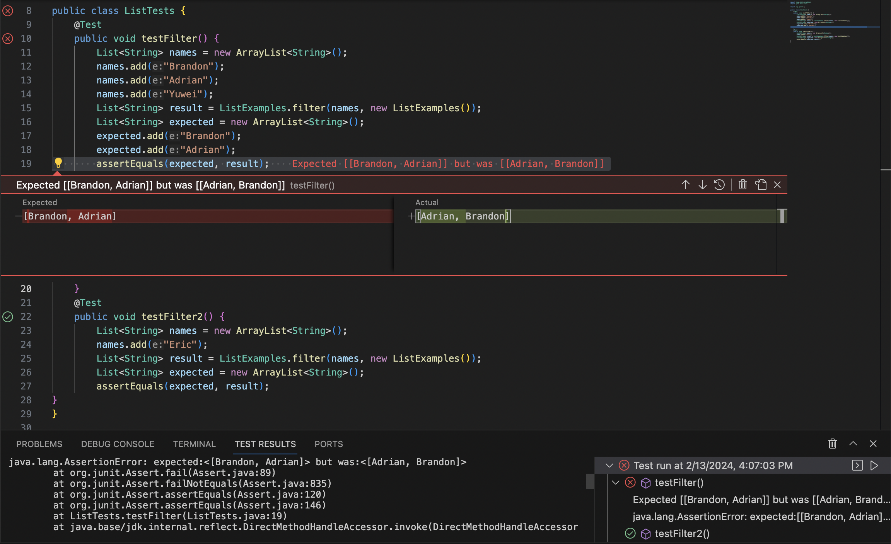
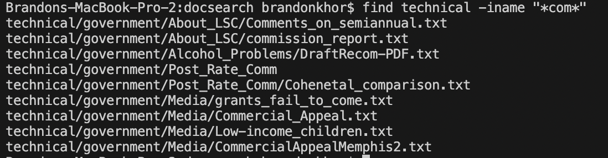
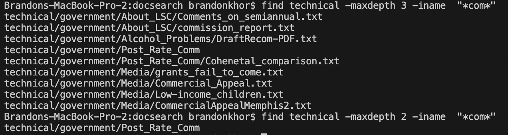

# Lab 3 Report
## Bugs
We will be focusing on a test case involving the `ListExamples` class, specifically the `filter` method. The `filter` method returns a list of all the strings that contain the character 'a' in a provided list. However, the code given has a bug.
### Failure-Inducing input
```
@Test
public void testFilter() {
        List<String> names = new ArrayList<String>();
        names.add("Brandon");
        names.add("Adrian");
        names.add("Yuwei");
        List<String> result = ListExamples.filter(names, new ListExamples());
        List<String> expected = new ArrayList<String>();
        expected.add("Brandon");
        expected.add("Adrian");
        assertEquals(expected, result)
}
```
### Valid Input
```
@Test
public void testFilter2() {
        List<String> names = new ArrayList<String>();
        names.add("Eric");
        List<String> result = ListExamples.filter(names, new ListExamples());
        List<String> expected = new ArrayList<String>();
        assertEquals(expected, result);
}
```
### Symptom

### Bug
The bug in the code is this line in the `filter` method in the `ListExamples` class:
`result.add(0, s);`

The issue is that elements that pass the filter will be prepended to the list because of the "0", messing up the original order.

This can be fixed by changing it to this:
`result.add(s);`

## Researching Commands

The command that I choose is `find`

`find -iname` is similar to using `find -name`, but it is case-insensitive. 


As we can see, even though alcohol_problems isn't the same as Alcohol_Problems in terms of capitilization, but `find -iname` is case-insensitive, so it still outputs the file path. Using `find -iname` will be useful when the user knows a file name, but not the capitilization.

Source: [Link](https://www.redhat.com/sysadmin/linux-find-command)



Another useful feature is the use of `"*(specified substring)*"`, which outputs everything that contains the specified substring. Pairing this with `find -iname` allows us to find all files that contain the substring, in this case "com", while remaining case-insensitive. Using `find -iname` with the wildcard will be useful when the user is searching for a file name with a keyword without worrying about capitilization/

Source: [Link](https://www.redhat.com/sysadmin/linux-find-command)

---

`find -maxdepth` limits how deep into a directory the `find` command will go.




