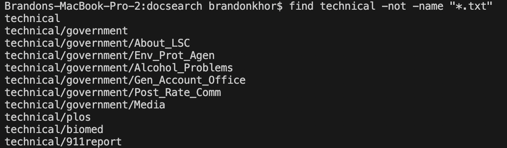
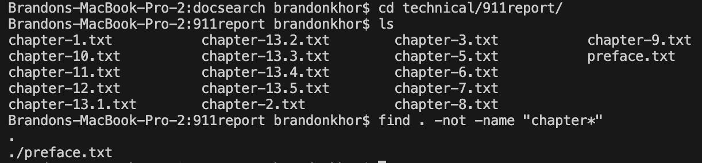
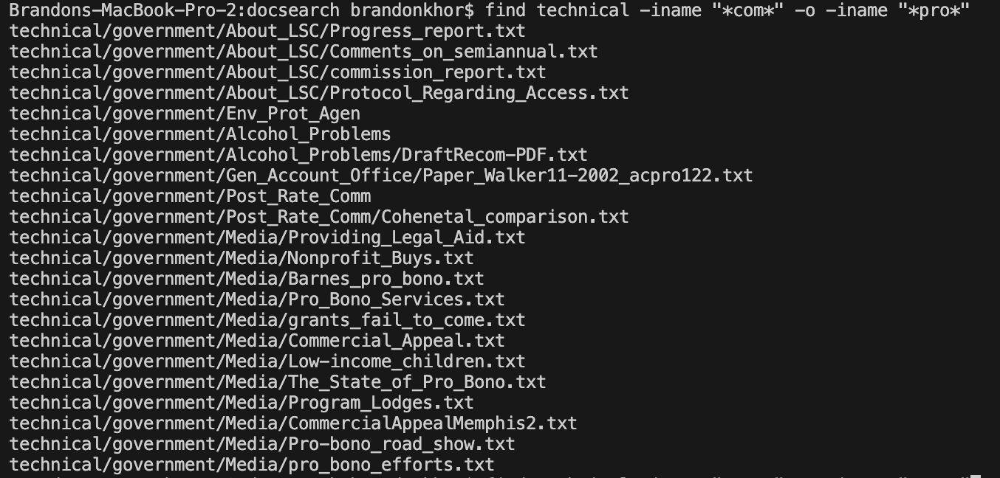
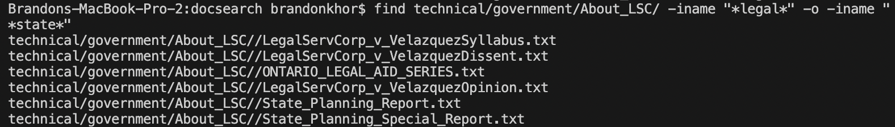

# Lab 3 Report
## Bugs
We will be focusing on a test case involving the `ListExamples` class, specifically the `filter` method. The `filter` method returns a list of all the strings that contain the character 'a' in a provided list. However, the code given has a bug.
### Failure-Inducing input
```
@Test
public void testFilter() {
        List<String> names = new ArrayList<String>();
        names.add("Brandon");
        names.add("Adrian");
        names.add("Yuwei");
        List<String> result = ListExamples.filter(names, new ListExamples());
        List<String> expected = new ArrayList<String>();
        expected.add("Brandon");
        expected.add("Adrian");
        assertEquals(expected, result)
}
```
### Valid Input
```
@Test
public void testFilter2() {
        List<String> names = new ArrayList<String>();
        names.add("Eric");
        List<String> result = ListExamples.filter(names, new ListExamples());
        List<String> expected = new ArrayList<String>();
        assertEquals(expected, result);
}
```
### Symptom

### Bug
The bug in the code is this line in the `filter` method in the `ListExamples` class:
`result.add(0, s);`

The issue is that elements that pass the filter will be prepended to the list because of the "0", messing up the original order.

This can be fixed by changing it to this:
`result.add(s);`

By removing the "0", since there is no index argument, the `add` method will default to appending `s` instead of prepending it, maintaining the order of the original list.

Before: 

After:

## Researching Commands

### The command that I choose is `find`

`find -iname` is similar to using `find -name`, but it is case-insensitive. 


As we can see, even though alcohol_problems isn't the same as Alcohol_Problems in terms of capitilization, but `find -iname` is case-insensitive, so it still outputs the file path. Using `find -iname` will be useful when the user knows a file name, but not the capitilization.

Source: [https://www.redhat.com/sysadmin/linux-find-command](https://www.redhat.com/sysadmin/linux-find-command)


Another useful feature is the use of `"*(specified substring)*"`, which outputs everything that contains the specified substring. Pairing this with `find -iname` allows us to find all files that contain the substring, in this case "com", while remaining case-insensitive. Using `find -iname` with the wildcard will be useful when the user is searching for a file name with a keyword without worrying about capitilization.

Source: [https://www.redhat.com/sysadmin/linux-find-command](https://www.redhat.com/sysadmin/linux-find-command)

---

`find -maxdepth` limits how deep into a directory the `find` command will go.


When `find technical -maxdepth 3 -iname  "*com*"` is called, it shows all files that contains the substring "com" with a maximum of 3 directories deep into `technical`. When `find technical -maxdepth 2 -iname  "*com*"` is called, it only shows 1 file, for it is the only file that contains the substring "com" with a maximum of 2 directories deep into `technical`. This command is useful when you want to search just the current directory or limit how deep you can go.

Source: [https://www.binarytides.com/linux-find-command-examples/](https://www.binarytides.com/linux-find-command-examples/)

---

`find ./test -not -name` is used to list the files that do not contain a given argument. This can be used to exclude specific file names or different file types.



In this example, every file that doesn't contain ".txt" is outputted. Since every file in `technical` is a .tx.t file, it only lists all the directories in `technical`. This would be useful for excluding a common file type, like if you're searching through your Downloads but don't want to list all your ".jpg" files.

Source: [https://www.binarytides.com/linux-find-command-examples/](https://www.binarytides.com/linux-find-command-examples/)



In this example, every file in `technical/911report` that doesn't contain "chapter" in it is outputted. This would be useful for excluding a common file name, like if you're searching through your Desktop but don't want to list all your screenshots.

Source: [https://www.binarytides.com/linux-find-command-examples/](https://www.binarytides.com/linux-find-command-examples/)

---

Using `-o` in find acts as an OR operator, allowing the user to search under multiple arguments.



In this example, we use `-o` to separate `-iname "*com*"` and `-iname "*pro*"`, allowing us to search `technical` for files/directories that contain the substring "com" OR "pro". This is just as useful as using `find`, for you can search for multiple specific arguments rather than just one.

Source: [https://linuxhandbook.com/find-command-examples/](https://linuxhandbook.com/find-command-examples/)



Another example of searching for two arguments, but in the same directory this time. This is just as useful as using `find`, for you can search for multiple specific arguments rather than just one.

Source: [Link](https://linuxhandbook.com/find-command-examples/)
