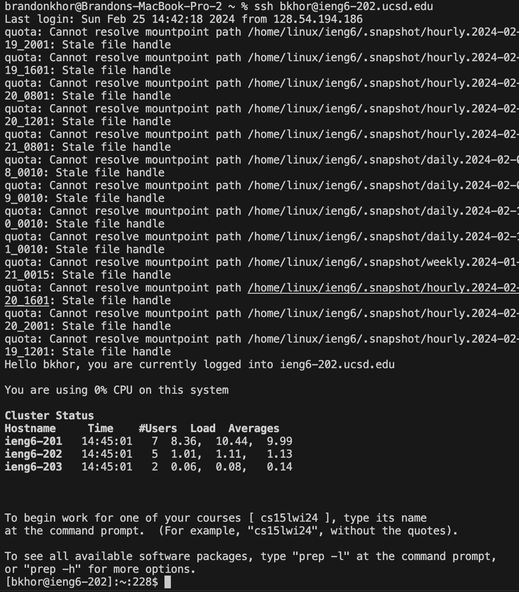
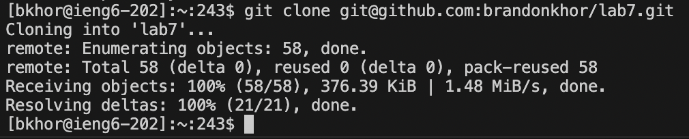
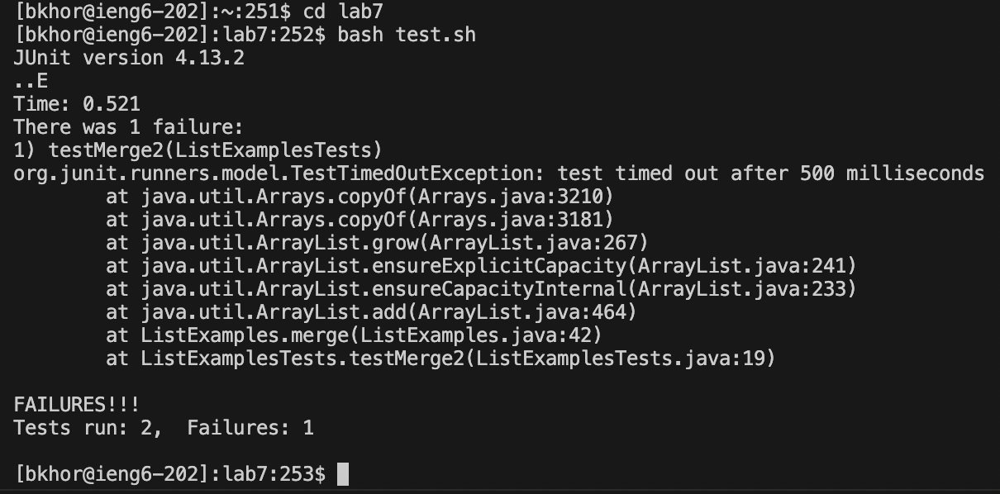
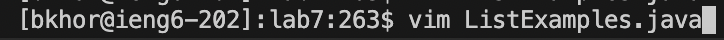
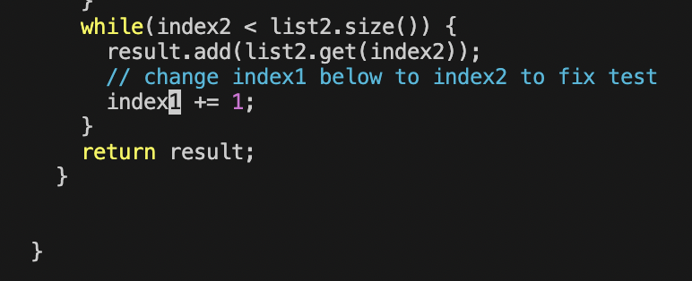
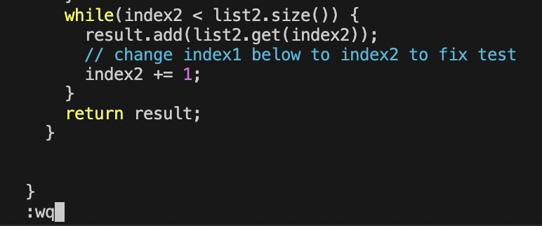
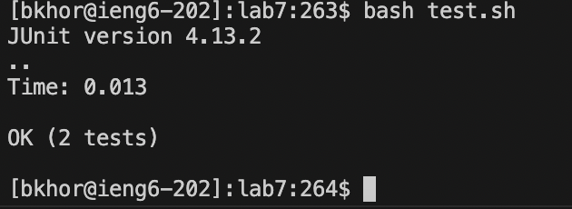
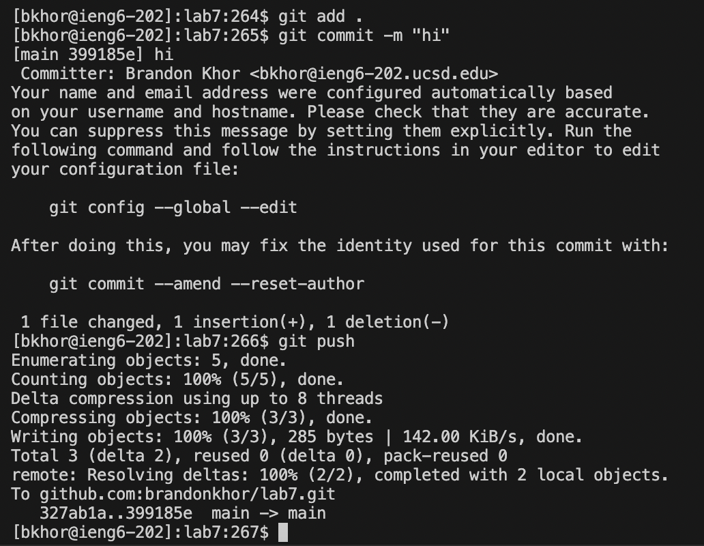

# Lab Report 4

## Step 4

Keys pressed: `<up><enter>` The `ssh bkhor@ieng6-202.ucsd.edu` command was 1 up in the search history, so I used the up arrow to access it. This step accesses the `ieng6` server.

---

## Step 5

Keys pressed: `<Ctrl+R> git c <enter>` The `git clone git@github.com:brandonkhor/lab7.git` command was the command that shows up when I pressed `<Ctrl+R>` and typed `git c`, autofilling to `git clone git@github.com:brandonkhor/lab7.git`. This step clones the repository that is used in the next steps.

---

## Step 6

Keys pressed: `<Ctrl+R> c <enter>`, `<Ctrl+R> b <enter>` I first changed the directory to lab7 using the command `cd lab7`, which I accessed using `<Ctrl+R>` and typed `c`, autofilling to `cd lab7`. Then I used `bash test.sh` to run the test cases, accessing it the same way as the previous one, but typing `b` instead to autofill to `bash test.sh`. This step puts us in the proper directory and runs the tests to show that there is a bug in the code.

---

## Step 7

Keys pressed: `<Ctrl+R> v <enter>`, `<Shift+g> 6k 11l r2 <ESC> <Shift+;> wq <enter>` 

I first used `<Ctrl+R>` and typed `v`, autofilling to `vim ListExamples.java`. 

Once viewing the file, I pressed `<Shift+g>` to start at the bottom of the page. I then pressed `6k`, which goes six lines up. Pressing `11l` will shift my cursor 11 characters to the right, landing it on top of the "1" in "index1". 

Then, I typed `r2` to replace the "1" with a "2". Finally, I pressed `<ESC>` and `<Shift+;>wq` to save and quit `vim`. This step edits `ListExamples.java` and fixes the bug.

---

## Step 8

Keys pressed: `<Ctrl+R> b <enter>` I used `bash test.sh` to run the test cases, accessing it the same way as I did in Step 6, but now all the tests pass. This step runs the tests to show that the tests now run correctly.

---

## Step 9

Keys pressed: `<Ctrl+R> git a <enter>`,  `<Ctrl+R> git co <enter>`,  `<Ctrl+R> git p <enter>` The `git add .` command is the command that pops up when using `<Ctrl+D>` and typing `git a`. The `git commit -m "hi"` command is the command that pops up when using `<Ctrl+D>` and typing `git co`. Finally, the `git push` command is the command that pops up when using `<Ctrl+D>` and typing `git p`. This command updates the code in the remote repository.
