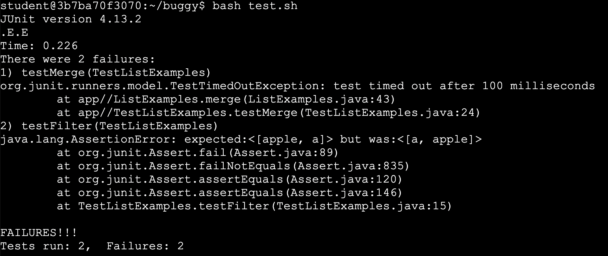
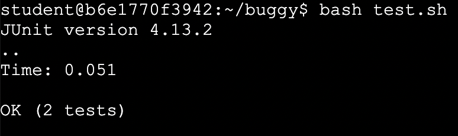
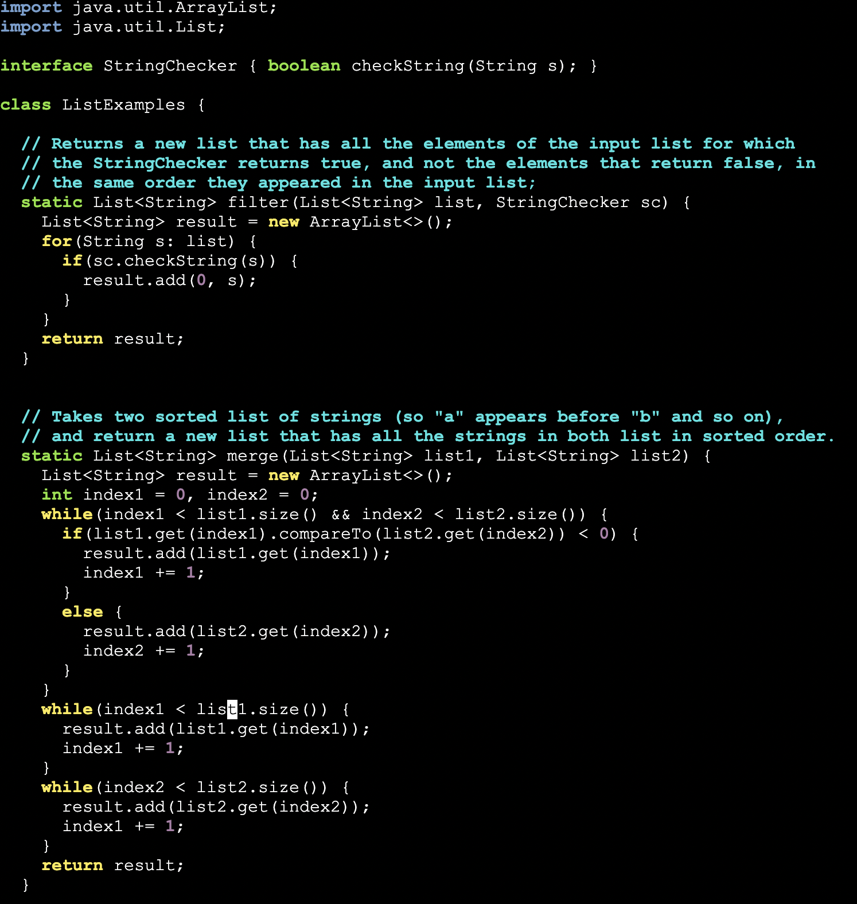

# Lab Report 5

## Part 1

__Brandon Khor__

Help! I am trying to do step 3 for practice skill demo 4, but I have no clue what to fix! Here is a screenshot of the symptom after running `bash test.sh` in `/home/student/buggy`:

I understand that the bugs are in the `ListExamples.java` file, but I have no clue where! The failure-inducing inputs are definitely in the `TestListExamples.java` file, but I am so sure that my expected values should match my actual! I see that for the `filter` method, the filter of accepting strings that contain the character 'a' is working, but it is in a different order than my test case! The terminal reads `expected:<[apple, a]> but was:<[a, apple]>`. As for the `merge` method, the error message isn't as helpful! It just says `test timed out after 100 milliseconds`! What am I supposed to do with that information!

__Andy (My glorious TA)__

Hmm. Very interesting! So first, let's look back at our symptom. What do you notice? Now, let's open up the `ListExamples.java` file with `vim` so we can look for bugs. We know that the error doesn't lie with the process of filtering in the `filter` method, but rather the ordering. Maybe look for a line in the code that is responsible for that? As for the `merge` method, think about common reasons why a program would time out. Why won't the program end?

__Brandon Khor__

Hmm, let me see... OH MY DAYS!!! IT'S PREPENDING INSTEAD OF APPENDING! That's why the order was so wack! If I go to line 15 and change `result(0, s);` to `result(s);` in the `filter` method, then the issue should be fixed! As for the `merge` method the program won't end if there is an infinite loop! And look here, there are 3 `while` loops in the `merge` method! Surely the bug must lie within those. And will you look at that! On line 43, `index2` isn't incremented at all, so the statement while loop will never stop! We can fix this by changing `index1` to `index2`. Alright, let's test the methods again!

Oh my goodness gracious, it works now! Hallelujah! What would I ever do without you Andy?!

__Information:__

The file structure is `/home/student/buggy` in the Skill Demo 4 workspace. The three files we work with in this directory is `ListExamples.java`, `TestListExamples.java`, and `test.sh`. However, the only file we edit is `ListExamples.java`.

This is the content in `/home/student/buggy/ListExamples.java` before the changes:

The full command line I ran that caused the bug is `bash test.sh`, which runs the commands `javac -cp .:lib/hamcrest-core-1.3.jar:lib/junit-4.13.2.jar *.java` and `java -cp .:lib/hamcrest-core-1.3.jar:lib/junit-4.13.2.jar org.junit.runner.JUnitCore TestListExamples`

The first bug was that the array was in reverse order. This is because elements were being prepended rather than appended in the `filter` method. To fix this, I edited line 15 and changed `result(0, s);` to `result(s);`.

The second bug was that the program was timing out when calling the `merge` method. This is because a variable wasn't being incremented, resulting in an infinite `while` loop. To fix this, I edited line 43 to `index1 += 1;` to `index2 += 1;`. With the right variable being incremented, the loop can exit.

## Part 2

I really enjoyed the technicalities of using the command line to do everything. Personally, I find all the shortcuts and tricks in `vim` to be interesting. It has also gave me a new appreciation for UI. `jdb` was probably the most useful thing I learned and it helped me in my other coding assignments. Overall, I always looked forward to my labs, for the environment was friendly, productive, and fun. Also shout out to the best TA Andy :D. I will make sure that the lessons I've learned in this class and I will continue to use these core principles in the future.

